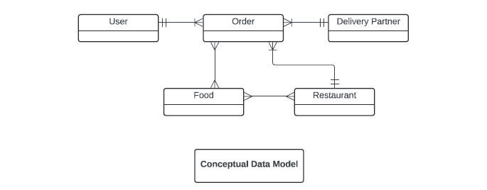

# Quickeats-SQL-Database

## Description
The objective of this project is to create a database system for food delivery that will help in running the "QuickEats" food delivery service. The system will handle food items, restaurant menus, customer orders, delivery logistics, and feedback, guaranteeing seamless operation for customers, delivery agents, and restaurant partners. Key company data, including user information, order details, restaurant listings, menu items, and delivery performance, will be stored and arranged in this database. The creation of this database will enable the system to keep track of each customer's past orders, let them order, explore menus from other restaurants, and ask for comments regarding their delivery experience. Data will be efficiently stored by the system, making it simple for business to retrieve it.

## Data Used and Source
The food_orders.xlsx file is the main source of data for this project and contains the important tables required for the database. The spreadsheet contains the following data:
•	Orders: Details regarding the orders placed by customers, such as the order number, user ID, restaurant ID, total amount, date, delivery partner, and customer review.
•	Restaurants: Information on restaurants that have partnered with the platform, such as name, ID, and type of cuisine served.
•	Menu: Details about the food items in restaurant menus, such as item ID, restaurant ID, price, and type (veg or non-veg).
•	Order Details: Detailed breakdown of every order, including amounts and related order IDs for each food item.
•	Users and Delivery Partners: Based on user IDs and partner IDs, the dataset provides indirect access to customer and delivery partner information.
These data points will help create various tables in the database that capture the relationships between customers, restaurants, food items, and the delivery process.

### Conceptual Model

